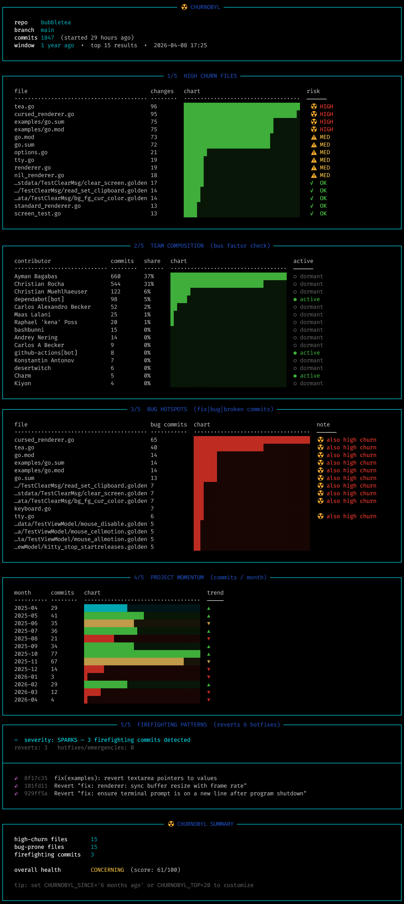

# ☢ Churnobyl

A terminal dashboard for examining a git repository's history before touching the code.
Runs five git-powered analyses and renders them in a colorful, box-drawn UI directly in your shell.

> 100% vibe coded with [Claude Code](https://claude.ai/code).

---



## What it does

Churnobyl runs five sections of analysis against any git repository. All commands are read-only, they only inspect git history and never modify, write, or affect the target repository in any way.

| Section | Git command(s) used | Description |
|---|---|---|
| **High Churn Files** | `git log --format=format: --name-only --since="1 year ago"` | Identifies the most-changed files in the time window. High churn on a file nobody wants to own is the clearest signal of codebase drag. |
| **Team Composition** | `git shortlog HEAD -sn --no-merges` | Ranks contributors by commit count to assess the bus factor: how dependent the project is on specific individuals. |
| **Bug Hotspots** | `git log -i -E --grep="fix\|bug\|broken\|patch\|hotfix\|revert"` | Filters commits by bug-related keywords to surface files that keep breaking and keep getting patched, but never get properly fixed. |
| **Project Momentum** | `git log --format='%ad' --date=format:'%Y-%m' --since="1 year ago"` | Shows monthly commit counts across history, revealing whether the team is accelerating or dying. |
| **Firefighting Patterns** | `git log --oneline --since="1 year ago" \| grep -iE 'revert\|hotfix\|emergency\|rollback\|critical\|urgent'` | Tracks reverts and hotfixes to indicate whether the team is stable or dealing with chronic deployment instability. |

---

## Usage

### Clone and run

```bash
git clone https://github.com/ezp127/churnobyl.git
cd churnobyl
chmod +x churnobyl.sh
```

Run against the repository you want to analyze:

```bash
./churnobyl.sh /path/to/repo
```

### Arguments

| Argument | Description |
|---|---|
| `[path]` | Optional path to a git repository. Defaults to the current directory. |

### Environment variables

| Variable | Default | Description |
|---|---|---|
| `CHURNOBYL_SINCE` | `1 year ago` | Time window for analysis (any value accepted by `git --since`). |
| `CHURNOBYL_TOP` | `15` | Maximum number of results to show per section. |

**Examples:**

```bash
CHURNOBYL_SINCE="6 months ago" ./churnobyl.sh
CHURNOBYL_TOP=20 ./churnobyl.sh ~/projects/my-repo
```

---

Inspired by [Git Commands I Run Before Reading Someone Else's Code](https://piechowski.io/post/git-commands-before-reading-code/) by Grzegorz Piechowski.
